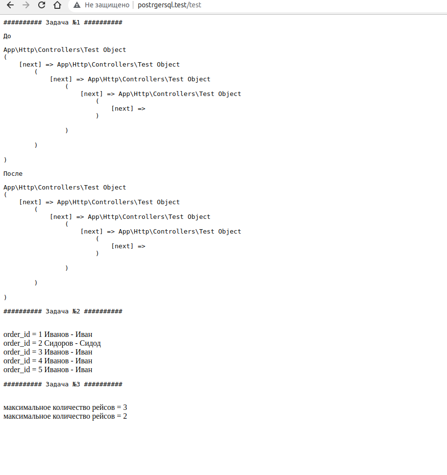

## Тестовое задание

########## Задача №1 ##########

Напишите функцию, которая развернёт список.
Последний элемент должен стать первым, а первый - последним.
$c→next должен содержать $b и так далее...

class test {
public $next;
}

$a = new test();
$b = new test();
$c = new test();
$a->next = $b;
$b->next = $c;
$c->next = null;

Пример результата:
function reverse($a) {
// какой-то код
}
$ob1 = reverse($a);
var_dump($ob1);

########## Задача №2 ##########

Даны две модели Order и Manager
class Order extends Model
{
public function manager()
{
return $this->hasOne('App\Manager');
}
}

class Manager extends Model
{
}

Каждый Order имеет manager_id. Manager имеет id, firstName, lastName
Необходимо вывести 50 заказов (Order) + fullName менеджера с минимальным кол-вом запросов к бд.
Дополните класс Order.
Реализовать нужно без использование join.

===========================

$orders = Order::with("manager")->take( 50 )

########## Задача №3 ##########

Даны веса посылок $boxes и вес, который может увезти курьер $weight.
Курьер должен возить по 2 посылки, которые вмес~~~~те по весу будут строго равны $weight.
Необходимо найти максимальное количество рейсов, которые курьер сможет сделать с учетом условий.

// первые входные данные
$boxes = [1, 2, 1, 5, 1, 3, 5, 2, 5, 5];
$weight = 6;
// вторые входные данные
$boxes = [2,4,3,6,1];
$weight = 5;

public function getResult(array $boxes, int $weight): int
{
// какой-то код
}

## Решение

1 Смотрите контроллер TestController::testTask()  Ссылка на контроллер: https://github.com/deen8122/test-task-laravel/blob/main/app/Http/Controllers/TestController.php 
2 Скриншот c результатами:  
3. Для запуска (если друг захочется делаем миграцию) 
